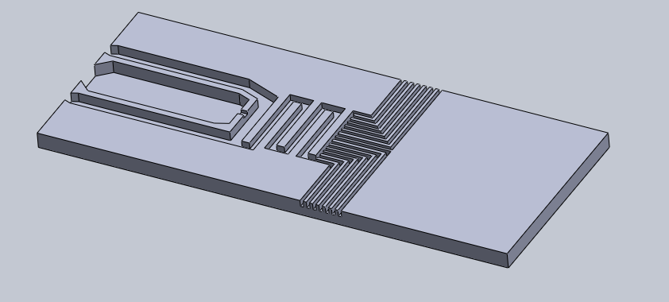
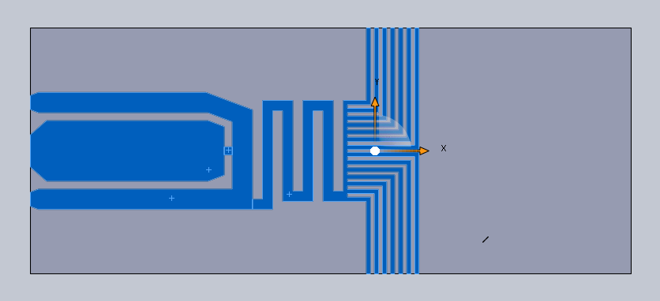
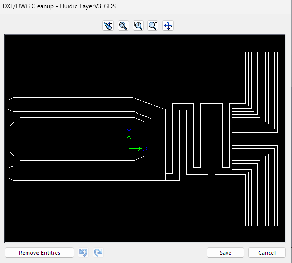

# 6. Custom Microfabricated Designs

Use this workflow when the mask geometry starts as a more complex 3D design, such as a **microfluidic device**.

## 1. Build the 3D design

Create the device in SolidWorks or another mechanical CAD program.
This allows to define the device fully in 3D, including the fluidic channels, ports, and any other features of different heights compared to just a 2D design.

## 2. Select the faces to fabricate

1. Orient the model so the fabrication layer is easy to see.
2. Select only the faces that should become the lithography pattern.
3. Hold **Ctrl** to select multiple faces.

The selected faces are the areas you want exported for fabrication.

You may wish to create multiple layers for different heights, in which case you can repeat this process for each layer and export them separately.
In this design there are three "floors". This in turns creates far more prolonged fabrication and will require two more photomasks.

## 3. Export the selected faces to DXF

1. In SolidWorks, click **File → Save As**.
2. Choose **DXF (`.dxf`)** as the file type.
3. Export the selected faces.
4. Check the DXF/DWG preview.
5. Click **Save** when the geometry looks correct.

## 4. Convert DXF to GDS

1. Open the `.dxf` file in a layout program that supports DXF import, such as **KLayout**.
2. Check the dimensions and units.
3. Put the geometry on the desired GDS layer.
4. Save/export the layout as **GDS (`.gds`)**.

The `.gds` file can then be used by most lithography systems.

## Quick check

Before fabrication, verify:

- the DXF scale is correct
- only the intended faces were exported
- no unwanted construction geometry is present
- the GDS layer and dimensions are correct
