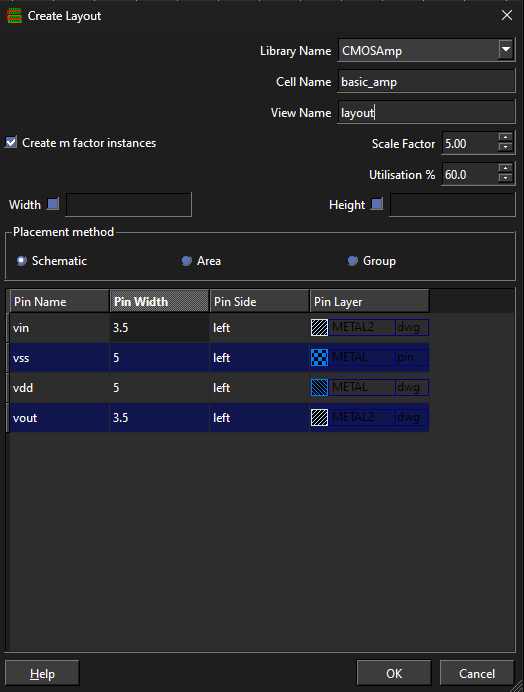
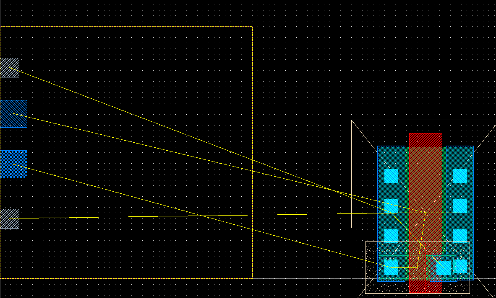
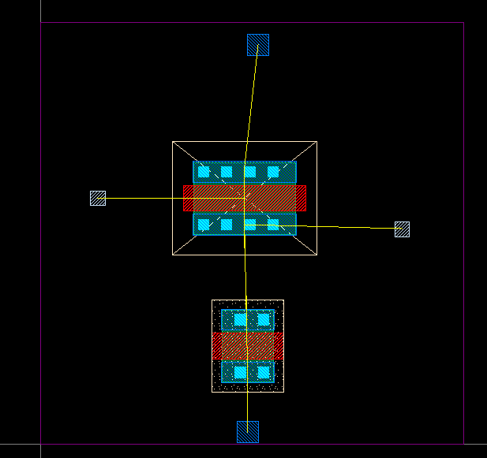
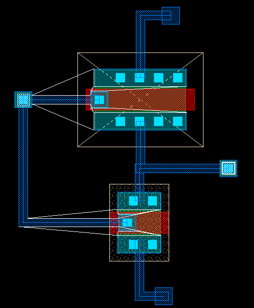
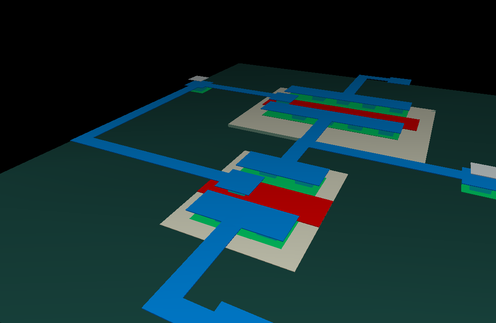

# 3. Generate and Route the Inverter Layout

## Save before touching the layout

Do this first. Routing is the point where you do not want to lose work.

1. Click **File → Save Cell**.
2. Open **Tools → Library Browser**.
3. Right-click your library name → **Save Library**.
4. Repeat both saves often while routing.

> **Important:** saving the cell and saving the library are separate actions. Do both.

## Create the layout from the schematic

1. Open the inverter `schematic`.
2. Click **Tools → Layout Generation**.
3. Create a new `layout` view from the schematic.
4. Keep **Create m factor instances** enabled.
5. Use the schematic placement method.
6. Click **OK**.



Glade places the PCells and shows yellow fly-lines for nets that still need routing.



## Save the generated layout

Before moving anything:

1. Click **File → Save Cell**.
2. In **Tools → Library Browser**, right-click your library → **Save Library**.

## Arrange the devices

1. Put the PMOS above the NMOS.
2. Keep the shared gate path short.
3. Keep the drain/output connection short.
4. Put `vdd` at the top and `vss` at the bottom.



Save the **cell** and **library** again.

## Open the Layer Selection Window

Before drawing any physical wire:

1. Click **Tools → LSW**.
2. `LSW` means **Layer Selection Window**.
3. Find the row named **METAL**.
4. Use the **METAL / dwg** row. `dwg` means the normal `drawing` purpose.
5. **Left-click the METAL layer name** so it becomes the current editing layer.

The current layer is highlighted in the LSW. New paths are drawn on that layer.

> **Do not accidentally select `METAL / pin` or `METAL / net`. For ordinary physical routing, use `METAL / dwg`.**

## Route with METAL

For the beginner inverter, most physical wiring should be done on **METAL / dwg**.

1. Make sure **METAL / dwg** is still selected in the LSW.
2. Click **Create → Path** or press **p**.
3. Click on the first terminal/contact you want to connect.
4. Click to place 90° corners as needed.
5. Click the destination terminal/contact.
6. Press **Enter** to finish the path.
7. Repeat until the yellow fly-line for that net disappears.

Keep paths Manhattan-style: horizontal and vertical whenever possible.

### Route these inverter nets

1. PMOS drain ↔ NMOS drain ↔ `vout`.
2. PMOS source/body ↔ `vdd`.
3. NMOS source/body ↔ `vss`.
4. Connect the two gates together ↔ `vin`.

## When the terminal is not already on METAL

CNM25 routing layers are **POLY1**, **METAL**, and **METAL2**.

If you need to change routing layers while drawing a path:

- press **u** to move up to the next routing layer
- press **d** to move down to the previous routing layer

Glade uses the CNM25 technology rules to insert the required contact/via when changing layers.

Typical transitions are:

```text
POLY1 ↔ WINDOW ↔ METAL
METAL ↔ VIA ↔ METAL2
```

> **Do not assume two different layers are connected just because they overlap visually. A valid contact or via must exist between them.**

For a gate connection, you may either route on **POLY1 / dwg**, or transition from POLY1 to METAL and continue on **METAL / dwg**.

## Check each connection as you go

After each net:

1. Confirm its yellow fly-line is gone.
2. Zoom in and make sure the path actually lands on the terminal/contact.
3. Click **File → Save Cell**.
4. Save the library again from **Tools → Library Browser**.



## Check the layout

1. Set the grid to **0.25 µm**.
2. Run the CNM25 DRC.
3. Fix every reported violation before continuing.
4. Save the cell and library one final time.

Optional 3D view:


