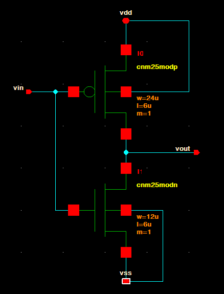
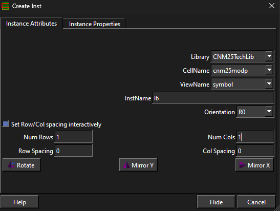

# 2. Build a CMOS Inverter

This is the first Glade sanity check. For CNM25 MOSFETs, use **L ≥ 3 µm**.



## Create the cell

1. In Glade, create a new library for your work if you do not already have one.
2. Create a new cell named `inverter`.
3. Create/open its `schematic` view.

## Place the PMOS

1. Click **Create → Instance**.
2. Set:
   - Library: `CNM25TechLib`
   - Cell: `cnm25modp`
   - View: `symbol`
3. Place it above the NMOS position.
4. Press **q** on the PMOS and set your `w`, `l`, and `m` values.



## Place the NMOS

1. Click **Create → Instance**.
2. Choose `CNM25TechLib → cnm25modn → symbol`.
3. Place it below the PMOS.
4. Press **q** and set `w`, `l`, and `m`.

## Wire it

Use **Create → Wire** (`Shift+A`).

1. Tie both gates together → `vin`.
2. Tie both drains together → `vout`.
3. PMOS source → `vdd`.
4. NMOS source → `vss`.
5. PMOS bulk/body → `vdd`.
6. NMOS bulk/body → `vss`.

## Add pins

Add pins for:

```text
vin
vout
vdd
vss
```

## Check and save

1. Click **Check → Check CellView**.
2. Fix everything until Glade reports:

```text
0 warnings, 0 errors
```

3. Click **File → Save Cell**.
4. Open **Tools → Library Browser**.
5. Right-click your library name → **Save Library**.

Do both saves before starting the layout.
