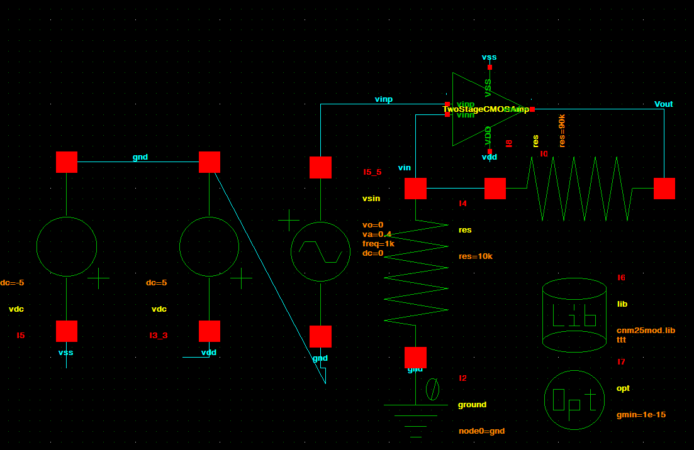
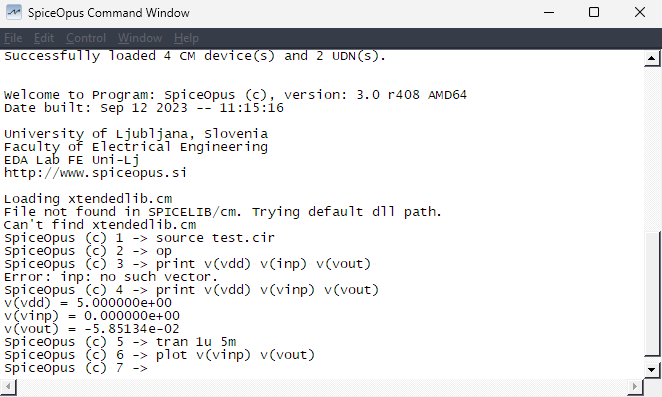
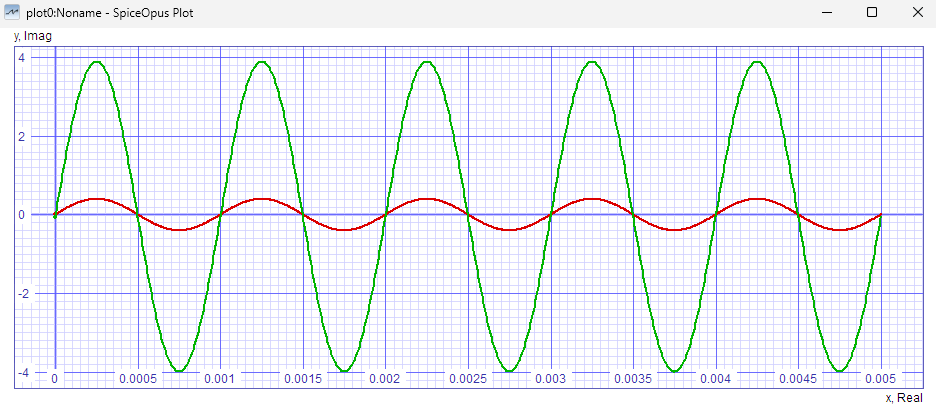

# 5. Simulate the Amplifier in SpiceOpus

> Use the **Glade → CDL export → SpiceOpus** flow here. Do not use Glade's `Simulate` menu for this tutorial.

Goal: apply a **1 kHz, 0.4 V-peak sine** and check for about **gain = 10**.

## 1. Create a simulation schematic

Create a new Glade cell named `Test` with a `schematic` view.

Place your amplifier symbol.

## 2. Make the ±5 V supplies

Place two `SPICE3Lib → vdc` sources.

### +5 V rail

Set:

```text
dc = 5
```

Connect it exactly like this:

```text
top terminal    = VDD
bottom terminal = gnd
```

### -5 V rail

Set the second source to:

```text
dc = 5
```

Reverse its connection:

```text
top terminal    = gnd
bottom terminal = VSS
```

With `dc = 5`, this makes `VSS = -5 V`.

## 3. Add SPICE ground

1. Place `SPICE3Lib → ground` anywhere.
2. Press **q**.
3. Set:

```text
node0 = gnd
```

The ground symbol has no wire pin. Use the net name **`gnd`** on the actual ground wires.

## 4. Add the sine input

Place `SPICE3Lib → vsin`.

Press **q** and set:

```text
vo   = 0
va   = 0.4
freq = 1k
dc   = 0
```

Connect the source between `vinp` and `gnd`.

## 5. Set gain = 10

Use two `SPICE3Lib → res` resistors:

```text
vout --- 90k --- vinn --- 10k --- gnd
```

Because:

```text
1 + 90k/10k = 10
```

## 6. Add the CNM25 model library

Place `SPICE3Lib → lib`.

Press **q** and enter **exactly**:

```text
filename = 'cnm25mod.lib'
section  = ttt
```

The single quotes around the filename are required by SpiceOpus.

## 7. Add the SPICE option

Place `SPICE3Lib → opt`.

Press **q** and set its `options` string to:

```text
gmin=1e-15
```

## 8. Final schematic check

Your test circuit should look like this:



Click **Check → Check CellView**.

Continue only when you have:

```text
0 warnings, 0 errors
```

## 9. Export the SPICE file

1. Click **File → Export → CDL**.
2. Save directly into:

```text
apdk/spiceopus/Test.cir
```

3. Make sure **Add .end for SPICE** is enabled.
4. Export.

> The menu says CDL, but for simulation type the output filename as **`Test.cir`**.

## 10. Run SpiceOpus

1. Open `apdk/spiceopus/`.
2. Launch **`spiceopus.bat`** (Windows) or **`spiceopus.sh`** (Linux).
3. At the prompt, enter:

```text
source Test.cir
```

If it says `Failed to open Test.cir`, make sure `Test.cir` is actually inside `apdk/spiceopus/`.

A startup warning about missing `xtendedlib.cm` can be ignored for this transistor-only test.

If SpiceOpus complains that the `.lib` filename needs single quotes, return to Glade and set:

```text
'cnm25mod.lib'
```

## 11. Plot input and output

Run:

```text
tran 1u 5m
```

Then:

```text
plot v(vinp) v(vout)
```

Expected quick check:

- Input: about **±0.4 V**
- Output: about **±4 V**
- Gain: about **10**





## Optional DC check

Before `tran`, you can run:

```text
op
print v(vdd) v(vinp) v(vout)
```

For this sine test, keep the source DC value at `0`.
