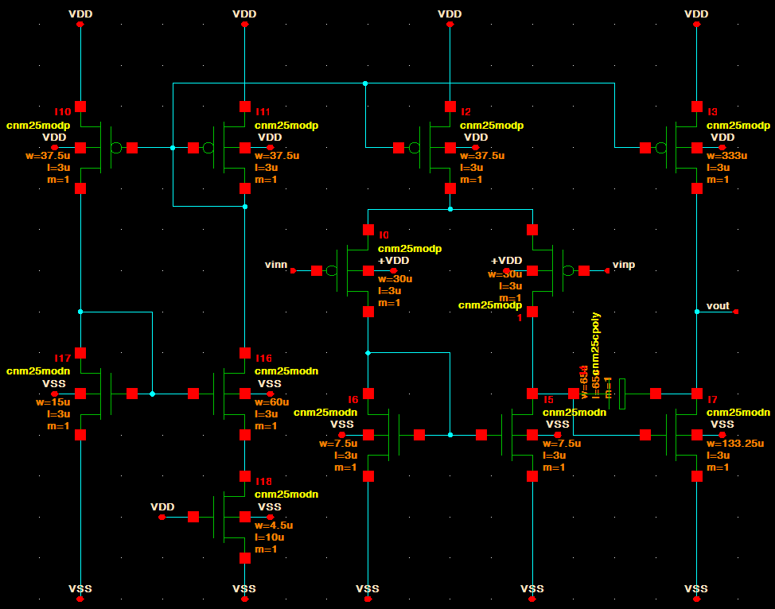
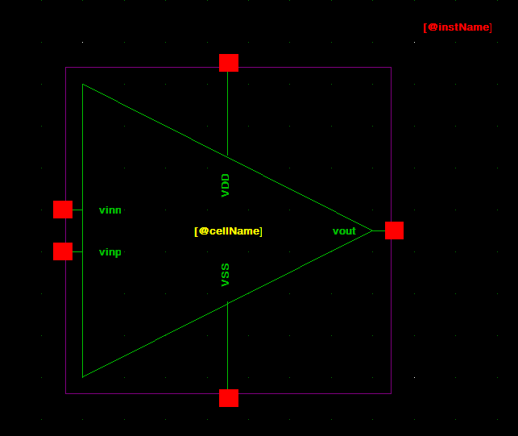

# 4. Build the Two-Stage CMOS Amplifier

Build the amplifier as a normal Glade schematic first. Do **not** start the layout yet.

1. Create a cell named `TwoStageCMOSAmp`.
2. Open/create its `schematic` view.
3. Click **Create → Instance** for every device.
4. Use `CNM25TechLib → cnm25modp → symbol` for PMOS devices.
5. Use `CNM25TechLib → cnm25modn → symbol` for NMOS devices.
6. Press **q** on each MOS and enter its `w`, `l`, and `m`.
7. Wire the devices to match the schematic below.



## CNM25 device sizes used here

| Device group | W / L |
|---|---:|
| Input PMOS pair | `30u / 3u` |
| NMOS active-load pair | `7.5u / 3u` |
| PMOS bias/mirror devices | `37.5u / 3u` |
| NMOS bias device | `15u / 3u` |
| NMOS ratio device | `60u / 3u` |
| MOS current-setting device | `4.5u / 10u` |
| Second-stage NMOS | `133.25u / 3u` |
| Second-stage PMOS | `333u / 3u` |

Use `m=1` unless you intentionally split a device into fingers/multipliers.

## Compensation capacitor

Click **Create → Instance**, then choose `CNM25TechLib → cnm25cpoly → symbol`. Set:

```text
w = 68.75u
l = 68.75u
m = 1
```

This is approximately **2 pF** at the typical CNM25 corner.

## Bulk/body connections

- Every **PMOS bulk** → `VDD`
- Every **NMOS bulk** → `VSS`

In layout, the PMOS bulk is the **NTUB/N-well** connection. Do not leave MOS bulk pins floating.

## External pins

Create these top-level pins:

```text
vinn
vinp
vout
VDD
VSS
```

## Check the amplifier

Click **Check → Check CellView**.

Fix everything until it reports:

```text
0 warnings, 0 errors
```

## Create the op-amp symbol

1. Keep the amplifier schematic open.
2. Click **Create → Create CellView from CellView**.
3. Create a **symbol** view.
4. Choose a **triangle** shape.
5. Put:
   - `vinn`, `vinp` on the left
   - `vout` on the right
   - `VDD` and `VSS` on top/bottom
6. Save the symbol.



Now use this symbol in the simulation schematic.
